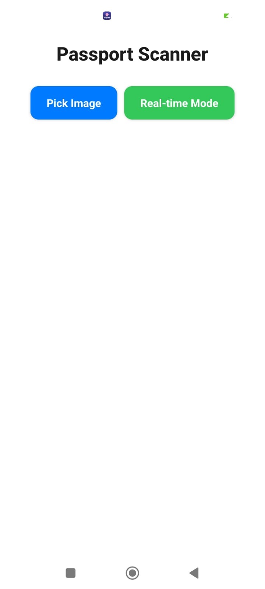
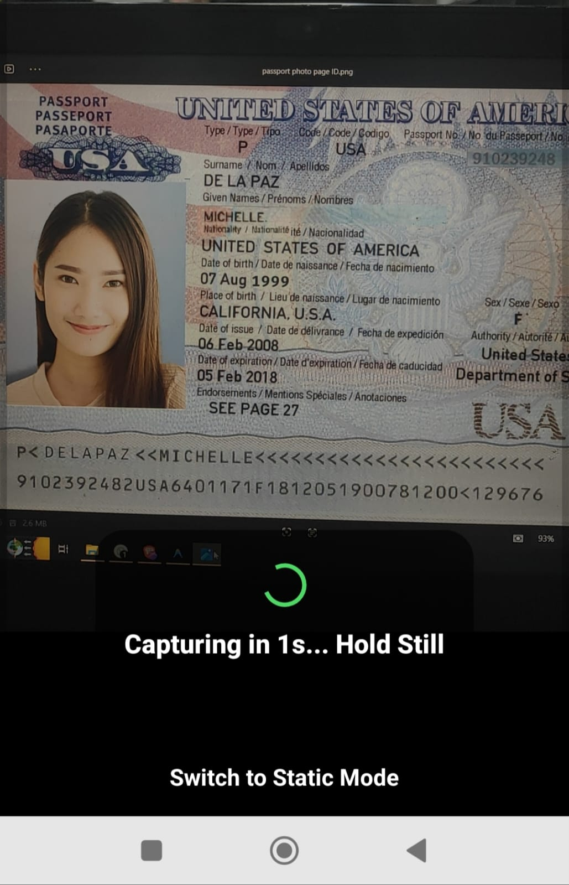
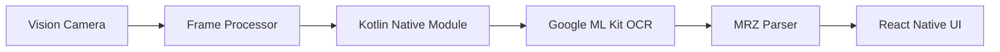

# React Native MRZ Scanner 📸

A powerful, real-time Machine Readable Zone (MRZ) scanner built with React Native and Expo. This application extracts data from passports, visas, and ID cards (TD1, TD2, TD3 formats) using Google ML Kit and a custom high-performance frame processor.

---

## 📸 Screenshots

<p align="center">
  
  
  
</p>

<p align="center">
  <span style="display:inline-block; width:28%; text-align:center;"><b>Main Screen</b></span>
  <span style="display:inline-block; width:28%; text-align:center;"><b>Real-time Scanning</b></span>
  <span style="display:inline-block; width:28%; text-align:center;"><b>Scan Result</b></span>
</p>

---

## ✨ Features

- **Real-time Scanning**: High-speed MRZ detection using `react-native-vision-camera`
- **Static Image OCR**: Pick an image from your gallery and extract MRZ data instantly
- **Smart Auto-Capture**: Automatically captures a high-resolution image when a stable MRZ is detected
- **Comprehensive Extraction**:
  - Surname
  - Given Names
  - Document Number
  - Nationality
  - Date of Birth
  - Sex
  - Expiry Date
- **Multi-Format Support**:
  - **TD3** — Passports (2 lines, 44 characters)
  - **TD2** — Visas and ID Documents
  - **TD1** — ID Cards
- **Smooth Camera Processing** using custom frame processors
- **On-Device OCR** with Google ML Kit
- **Low-Latency Processing** using Worklets Core

---

## 🛠️ Tech Stack

| Layer | Technologies |
|---|---|
| Core | React Native, Expo |
| Camera | React Native Vision Camera |
| Processing | React Native Worklets Core |
| OCR Engine | Google ML Kit Text Recognition |
| Native Layer | Kotlin Native Modules |
| Language | TypeScript, Kotlin |

---

## 🏗️ Architecture

The application uses a hybrid React Native + native Android architecture for low-latency OCR processing.

### Processing Flow

1. Vision Camera streams frames from the camera
2. A custom frame processor analyzes frames on the camera thread
3. Native Kotlin modules run Google ML Kit OCR
4. MRZ text is parsed and validated natively
5. Parsed results are returned to the React Native UI



---

## 🪪 Supported Documents

| Format | Document Type |
|---|---|
| TD1 | ID Cards |
| TD2 | Visas / Identity Documents |
| TD3 | Passports |

---

## ⚡ Performance

- Real-time OCR processing directly on the camera thread
- Fully on-device OCR with no internet dependency
- Native Kotlin processing for reduced JS bridge overhead
- Automatic stable-frame detection before capture
- Optimized for low-latency scanning

---

## 🧠 Why Frame Processors & Worklets?

The scanner uses Vision Camera frame processors with Worklets Core to execute frame analysis outside the JavaScript thread.

### Benefits

- Real-time frame processing
- Lower latency
- Reduced dropped frames
- Smooth camera preview during OCR
- Better responsiveness during continuous scanning

---

## 📂 Project Structure

```text
├── android/            # Native Android implementation (ML Kit & MRZ Parser)
├── assets/             # App icons, splash screen, and screenshots
├── src/
│   ├── components/     # UI components
│   ├── native/         # Native modules & Frame Processors
│   └── types/          # TypeScript definitions
└── App.tsx             # Application entry point
```

---

## 🚀 Getting Started

### Prerequisites

- Node.js (v18+)
- Android Studio / Xcode
- Expo CLI

### Installation

#### 1. Clone the repository

```bash
git clone https://github.com/harya72/vision-camera-mrz.git
cd vision-camera-mrz
```

#### 2. Install dependencies

```bash
yarn install

# or

npm install
```

#### 3. Run the application

### Android

```bash
npm run android
```

### Expo Development

```bash
npm start
```

---

## 📦 Download

Download the APK directly:

- **[Download APK](https://drive.google.com/file/d/1ZDNCHGHnJgkbveVUtli3n89RxiqNvJjO/view?usp=sharing)**

---

## 🛡️ Permissions

The application requires the following permissions:

- **Camera** — Real-time MRZ scanning
- **Media Library** — Selecting images from the gallery

---

## 🤝 Contributing

Contributions, issues, and feature requests are welcome.

Feel free to open an issue or submit a pull request.

---

## 📝 License

This project is licensed under the MIT License.

---

*Built for efficient real-time MRZ extraction and mobile OCR processing.*